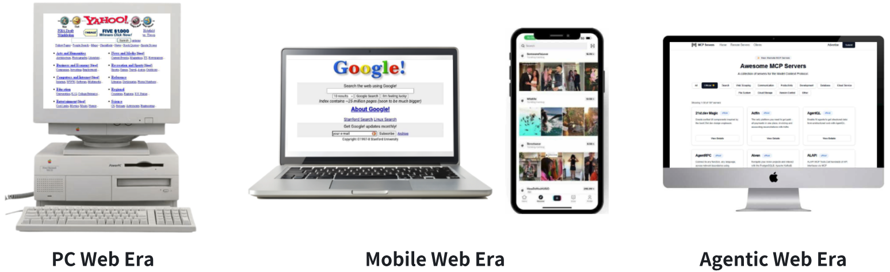
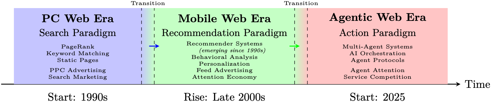

<h1 align="center" style="font-size: 30px;"><strong><em>Agentic Web</em></strong>: Weaving the Next Web with AI Agents</h1>

**[Yingxuan Yang](#)<sup>1</sup>   [Mulei Ma](#)<sup>2</sup>   [Yuxuan Huang](#)<sup>3</sup>   [Huacan Chai](#)<sup>1</sup>   [Chenyu Gong](#)<sup>2</sup>   [Haoran Geng](#)<sup>4</sup>   [Yuanjian Zhou](#)<sup>5</sup>   [Ying Wen](#)<sup>1</sup>   [Meng Fang](#)<sup>3</sup>   [Muhao Chen](#)<sup>6</sup>   [Shangding Gu](#)<sup>4\*</sup>   [Ming Jin](#)<sup>7</sup>   [Costas Spanos](#)<sup>4</sup>   [Yang Yang](#)<sup>2</sup>   [Pieter Abbeel](#)<sup>4</sup>   [Dawn Song](#)<sup>4</sup>   [Weinan Zhang](#)<sup>1,5\*</sup>   [Jun Wang](#)<sup>8\*</sup>**

<sup>**1**</sup>Shanghai Jiao Tong University   <sup>**2**</sup>The Hong Kong University of Science and Technology, Guangzhou   <sup>**3**</sup>University of Liverpool   <sup>**4**</sup>University of California, Berkeley   <sup>**5**</sup>Shanghai Innovation Institute   <sup>**6**</sup>University of California, Davis   <sup>**7**</sup>Virginia Tech   <sup>**8**</sup>University College London

\* Corresponding authors.

---

The repository is for *Agentic Web* research, in which we investigate various agentic web studies. If any authors do not want their paper to be listed here, please feel free to contact <shangding.gu@berkeley.edu>. (This repository is under actively development. We appreciate any constructive comments and suggestions)


You are more than welcome to update this list! If you find a paper about agentic web which is not listed here, please

- fork this repository, add it and merge back;
- or report an issue here;
- or email shangding.gu@berkeley.edu

**Content**
- [Agentic Web Development](#agentic-web-development)
- [Information Retrieval](#information-retrieval)
- [Recommendation](#recommendation)
- [Agent Planning](#agent-planning)
- [Multi-Agent Learning](#multi-agent-learning)
- [Safety and Security](#safety-and-security)
- [Benchmark](#benchmark)
- [Citation](#citation)
---

<div align="center">
    
</div>
<div align="center">
<b>Figure 1</b>: Web Evolution: From Directories to Agents.
</div>
</br>

<div align="center">
    
</div>
<div align="center">
<b>Figure 2</b>: Timeline of Web Evolution: Three Major Eras. Note: These eras are not strictly separated. Transitions occurred gradually, and features of one era often coexisted with the next. Technologies and business models frequently overlapped during these transitions.
</div>

## Agentic Web Development

- [Plan-and-act: Improving planning of agents for long-horizon tasks](https://arxiv.org/pdf/2503.09572) by Erdogan, Lutfi Eren, Nicholas Lee, Sehoon Kim, Suhong Moon, Hiroki Furuta, Gopala Anumanchipalli, Kurt Keutzer, and Amir Gholami. 2025
- [From Web Search towards Agentic Deep Research: Incentivizing Search with Reasoning Agents](https://arxiv.org/pdf/2506.18959) by Zhang, Weizhi, Yangning Li, Yuanchen Bei, Junyu Luo, Guancheng Wan, Liangwei Yang, Chenxuan Xie et al. 2025
- [MA-RAG: Multi-Agent Retrieval-Augmented Generation via Collaborative Chain-of-Thought Reasoning](https://arxiv.org/pdf/2505.20096?) by Nguyen, Thang, Peter Chin, and Yu-Wing Tai. 2025 
- [Deep Research Agents: A Systematic Examination And Roadmap](https://arxiv.org/pdf/2506.18096) by Huang, Yuxuan, Yihang Chen, Haozheng Zhang, Kang Li, Meng Fang, Linyi Yang, Xiaoguang Li et al. 2025
- [ArchRAG: Attributed Community-based Hierarchical Retrieval-Augmented Generation](https://arxiv.org/pdf/2502.09891?) by Wang, Shu, Yixiang Fang, Yingli Zhou, Xilin Liu, and Yuchi Ma. 2025
- [Macrec: A multi-agent collaboration framework for recommendation](https://dl.acm.org/doi/pdf/10.1145/3626772.3657669) by Wang, Zhefan, Yuanqing Yu, Wendi Zheng, Weizhi Ma, and Min Zhang. 2024
- [Webarena: A realistic web environment for building autonomous agents](https://arxiv.org/pdf/2307.13854) by Zhou, Shuyan, Frank F. Xu, Hao Zhu, Xuhui Zhou, Robert Lo, Abishek Sridhar, Xianyi Cheng et al. 2023
- [Toolllm: Facilitating large language models to master 16000+ real-world apis](https://arxiv.org/pdf/2307.16789) by Qin, Yujia, Shihao Liang, Yining Ye, Kunlun Zhu, Lan Yan, Yaxi Lu, Yankai Lin et al. 2023
- [Api-bank: A comprehensive benchmark for tool-augmented llms](https://arxiv.org/pdf/2304.08244) by Li, Minghao, Yingxiu Zhao, Bowen Yu, Feifan Song, Hangyu Li, Haiyang Yu, Zhoujun Li, Fei Huang, and Yongbin Li.  2023
- [React: Synergizing reasoning and acting in language models](https://par.nsf.gov/servlets/purl/10451467) by Yao, Shunyu, Jeffrey Zhao, Dian Yu, Nan Du, Izhak Shafran, Karthik Narasimhan, and Yuan Cao. 2023
- [Voyager: An open-ended embodied agent with large language models](https://arxiv.org/pdf/2305.16291) by Wang, Guanzhi, Yuqi Xie, Yunfan Jiang, Ajay Mandlekar, Chaowei Xiao, Yuke Zhu, Linxi Fan, and Anima Anandkumar. 2023
- [Toolformer: Language models can teach themselves to use tools](https://proceedings.neurips.cc/paper_files/paper/2023/file/d842425e4bf79ba039352da0f658a906-Paper-Conference.pdf) by Schick, Timo, Jane Dwivedi-Yu, Roberto Dessì, Roberta Raileanu, Maria Lomeli, Eric Hambro, Luke Zettlemoyer, Nicola Cancedda, and Thomas Scialom.  2023
- [Swe-bench: Can language models resolve real-world github issues?](https://arxiv.org/pdf/2310.06770) by Jimenez, Carlos E., John Yang, Alexander Wettig, Shunyu Yao, Kexin Pei, Ofir Press, and Karthik Narasimhan. 2023
- [Hugginggpt: Solving ai tasks with chatgpt and its friends in hugging face](https://proceedings.neurips.cc/paper_files/paper/2023/file/77c33e6a367922d003ff102ffb92b658-Paper-Conference.pdf) by Shen, Yongliang, Kaitao Song, Xu Tan, Dongsheng Li, Weiming Lu, and Yueting Zhuang. 2023
- [Training language models to follow instructions with human feedback](https://proceedings.neurips.cc/paper_files/paper/2022/file/b1efde53be364a73914f58805a001731-Paper-Conference.pdf) by Ouyang, Long, Jeffrey Wu, Xu Jiang, Diogo Almeida, Carroll Wainwright, Pamela Mishkin, Chong Zhang et al. 2022
- [Webgpt: Browser-assisted question-answering with human feedback](https://arxiv.org/pdf/2112.09332) by Nakano, Reiichiro, Jacob Hilton, Suchir Balaji, Jeff Wu, Long Ouyang, Christina Kim, Christopher Hesse et al. 2021
- [Deep reinforcement learning for list-wise recommendations](https://arxiv.org/pdf/1801.00209) by Zhao, Xiangyu, Liang Zhang, Long Xia, Zhuoye Ding, Dawei Yin, and Jiliang Tang.  2019
- [SlateQ: A Tractable Decomposition for Reinforcement Learning with Recommendation Sets.](https://www.cs.toronto.edu/~cebly/Papers/SlateQ_IJCAI_2019.pdf) by Ie, Eugene, Vihan Jain, Jing Wang, Sanmit Narvekar, Ritesh Agarwal, Rui Wu, Heng-Tze Cheng, Tushar Chandra, and Craig Boutilier. 2019

## Information Retrieval

- [Agentic information retrieval](https://arxiv.org/pdf/2410.09713?) by Zhang, Weinan, Junwei Liao, Ning Li, Kounianhua Du, and Jianghao Lin. 2025
- [Large language models for generative information extraction: A survey](https://link.springer.com/content/pdf/10.1007/s11704-024-40555-y.pdf) by Xu, Derong, Wei Chen, Wenjun Peng, Chao Zhang, Tong Xu, Xiangyu Zhao, Xian Wu, Yefeng Zheng, Yang Wang, and Enhong Chen. 2024
- [Bias and unfairness in information retrieval systems: New challenges in the llm era](https://dl.acm.org/doi/pdf/10.1145/3637528.3671458) by Dai, Sunhao, Chen Xu, Shicheng Xu, Liang Pang, Zhenhua Dong, and Jun Xu. 2024
- [Retrieval-augmented code generation for universal information extraction](https://arxiv.org/pdf/2311.02962) by Guo, Yucan, Zixuan Li, Xiaolong Jin, Yantao Liu, Yutao Zeng, Wenxuan Liu, Xiang Li et al. 2024
- [Large language models for information retrieval: A survey](https://arxiv.org/pdf/2308.07107) by Zhu, Yutao, Huaying Yuan, Shuting Wang, Jiongnan Liu, Wenhan Liu, Chenlong Deng, Haonan Chen, Zheng Liu, Zhicheng Dou, and Ji-Rong Wen. 2023
- [Inpars-v2: Large language models as efficient dataset generators for information retrieval](https://arxiv.org/pdf/2301.01820) by Jeronymo, Vitor, Luiz Bonifacio, Hugo Abonizio, Marzieh Fadaee, Roberto Lotufo, Jakub Zavrel, and Rodrigo Nogueira. 2023
- [Unified structure generation for universal information extraction](https://arxiv.org/pdf/2203.12277) by Lu, Yaojie, Qing Liu, Dai Dai, Xinyan Xiao, Hongyu Lin, Xianpei Han, Le Sun, and Hua Wu. 2022
- [An Adversarial Imitation Click Model for Information Retrieval](https://dl.acm.org/doi/pdf/10.1145/3442381.3449913?casa_token=uxTFt1GHdzYAAAAA:oYcBl_NFP7Rx-rB1c6Ol_aGVykWPtWWBUmkjuulSP_eEONMgYsnJJOJRHobEUI5aTic8j88fz7qd) by Dai, Xinyi, Jianghao Lin, Weinan Zhang, Shuai Li, Weiwen Liu, Ruiming Tang, Xiuqiang He, Jianye Hao, Jun Wang, and Yong Yu. 2021
- [A survey on deep matrix factorizations](https://www.sciencedirect.com/science/article/pii/S1574013721000630?casa_token=X2qx6lyiRwgAAAAA:DDn-5yrnsytdljuWnDKVW0B_xmJGsM67KFR1nosP_37MiozL88O-dfysupN-KenOJ1YX7SDPJQ) by De Handschutter, Pierre, Nicolas Gillis, and Xavier Siebert. 2021
- [Deepcf: A unified framework of representation learning and matching function learning in recommender system](https://arxiv.org/pdf/1901.04704) by Deng, Zhi-Hong, Ling Huang, Chang-Dong Wang, Jian-Huang Lai, and Philip S. Yu.  2019
- [On the Equilibrium of Query Reformulation and Document Retrieval](https://dl.acm.org/doi/pdf/10.1145/3234944.3234962?casa_token=uohit0RoaXgAAAAA:kBBh30W1qHWnaYytiXtgLMGnvTszUPxfBSzLNA29Tik0gQ7-DeECH2lqzUM1Qim9kZ4OhisDxyHT) by Zou, Shihao, Guanyu Tao, Jun Wang, Weinan Zhang, and Dell Zhang. 2018
- [Irgan: A minimax game for unifying generative and discriminative information retrieval models](https://dl.acm.org/doi/pdf/10.1145/3077136.3080786?casa_token=ewZ3STWowa0AAAAA:GOB0cDaNh9gqsZd41Yu2CR_BPRiOrmaWoVa8iHhXw3FEASrhqe3W6rqs21FUYCWrCzuYuuV_nOyS) by Wang, Jun, Lantao Yu, Weinan Zhang, Yu Gong, Yinghui Xu, Benyou Wang, Peng Zhang, and Dell Zhang. 2017
- [Neural collaborative filtering](https://dl.acm.org/doi/pdf/10.1145/3038912.3052569?casa_token=voDsTiXaNKAAAAAA:RCPudBDnAYslj7UDu02FBvZAEN-vgTXy0ttzVpjDOVPi6TiXakxTw3vK18WV0POM8lcZTUh0e8fp) by  He, Xiangnan, Lizi Liao, Hanwang Zhang, Liqiang Nie, Xia Hu, and Tat-Seng Chua. 2017
- [DeepFM: a factorization-machine based neural network for CTR prediction](https://arxiv.org/pdf/1703.04247) by Guo, Huifeng, Ruiming Tang, Yunming Ye, Zhenguo Li, and Xiuqiang He. 2017
- [Wide & deep learning for recommender systems](https://dl.acm.org/doi/pdf/10.1145/2988450.2988454) by Cheng, Heng-Tze, Levent Koc, Jeremiah Harmsen, Tal Shaked, Tushar Chandra, Hrishi Aradhye, Glen Anderson et al. 2016
- [Autorec: Autoencoders meet collaborative filtering](https://dl.acm.org/doi/pdf/10.1145/2740908.2742726?casa_token=TPRVrykjKM0AAAAA:eOATJu7QXZu8KoFHwK6Zfbw6PJS1LrTCMDTXzIGKiwW02QHqTwmJDlDqCVoClCDKLYtrvFQBdvSm) by Sedhain, Suvash, Aditya Krishna Menon, Scott Sanner, and Lexing Xie.  2015
- [Top-k Retrieval using Facility Location Analysis](https://citeseerx.ist.psu.edu/document?repid=rep1&type=pdf&doi=f34d6ac976f927f30b91618437604500006de3d2) by Zuccon, Guido, Leif Azzopardi, Dell Zhang, and Jun Wang. 2012
- [Mean-variance analysis: A new document ranking theory in information retrieval](http://web4.cs.ucl.ac.uk/staff/jun.wang/papers/2009-ecir09-mva.pdf) by Wang, Jun. 2009
- [Portfolio theory of information retrieval](https://dl.acm.org/doi/pdf/10.1145/1571941.1571963?casa_token=D8WiNZD_4b8AAAAA:f2oduiAJ3xYRq6oNRlRV-w7FYKAIq9-SVwcEUm9BXXu0KloUsgg_mazWw6VRM4nm_X6jpY23eC2W) by Wang, Jun, and Jianhan Zhu. 2009
- [The probabilistic relevance framework: BM25 and beyond](https://www.nowpublishers.com/article/Details/INR-019) by Robertson, Stephen, and Hugo Zaragoza. 2009
- [Matrix factorization techniques for recommender systems](https://ieeexplore.ieee.org/document/5197422?denied=) by Koren, Yehuda, Robert Bell, and Chris Volinsky. 2009
- [Internet advertising and the generalized second-price auction: Selling billions of dollars worth of keywords](https://www.nber.org/system/files/working_papers/w11765/w11765.pdf) by Edelman, Benjamin, Michael Ostrovsky, and Michael Schwarz. 2007
- [A user-item relevance model for log-based collaborative filtering](https://citeseerx.ist.psu.edu/document?repid=rep1&type=pdf&doi=53d0c7d5563edb817f02b41515e68ffbc5a649fd) by Wang, Jun, Arjen P. De Vries, and Marcel JT Reinders. 2006 
- [Item-based collaborative filtering recommendation algorithms](https://dl.acm.org/doi/pdf/10.1145/371920.372071?casa_token=tJ1WytFOvQYAAAAA:VH6P6CmYuDJQkFZMw-YiD_zqnuJ_sDYXXcvn1QxZXRCe9q13cK6xZJs-gd7UfAv-bzF6vo6OjTYu) by Sarwar, Badrul, George Karypis, Joseph Konstan, and John Riedl. 2001
- [The PageRank citation ranking: Bringing order to the web](http://ilpubs.stanford.edu:8090/422/1/1999-66.pdf) by Page, Lawrence, Sergey Brin, Rajeev Motwani, and Terry Winograd. 1999
- [Indexing by latent semantic analysis](http://ryanrossi.com/teaching/search/papers/indexing_by_LSA.pdf) by Deerwester, Scott, Susan T. Dumais, George W. Furnas, Thomas K. Landauer, and Richard Harshman. 1990
- [A statistical interpretation of term specificity and its application in retrieval](https://www.emerald.com/insight/content/doi/10.1108/eb026526/full/html) by Sparck Jones, Karen.  1972

## Recommendation
- [A survey of large language model empowered agents for recommendation and search: Towards next-generation information retrieval](https://arxiv.org/pdf/2503.05659) by Zhang, Yu, Shutong Qiao, Jiaqi Zhang, Tzu-Heng Lin, Chen Gao, and Yong Li. 2025
- [A survey on llm-powered agents for recommender systems](https://arxiv.org/pdf/2502.10050?) by Peng, Qiyao, Hongtao Liu, Hua Huang, Qing Yang, and Minglai Shao. 2025
- [AgentRecBench: Benchmarking LLM Agent-based Personalized Recommender Systems](https://arxiv.org/pdf/2505.19623?) by Shang, Yu, Peijie Liu, Yuwei Yan, Zijing Wu, Leheng Sheng, Yuanqing Yu, Chumeng Jiang et al. 2025
- [Deep reinforcement learning based resource allocation for network slicing with massive MIMO](https://ieeexplore.ieee.org/stamp/stamp.jsp?arnumber=10186882) by Yan, Dandan, Benjamin K. Ng, Wei Ke, and Chan-Tong Lam. 2024
- [Macrec: A multi-agent collaboration framework for recommendation](https://dl.acm.org/doi/pdf/10.1145/3626772.3657669) by Wang, Zhefan, Yuanqing Yu, Wendi Zheng, Weizhi Ma, and Min Zhang. 2024
- [Raserec: Retrieval-augmented sequential recommendation](https://arxiv.org/pdf/2412.18378) by Zhao, Xinping, Baotian Hu, Yan Zhong, Shouzheng Huang, Zihao Zheng, Meng Wang, Haofen Wang, and Min Zhang. 2024
- [Probing early modification of gravity with Planck, ACT and SPT](https://arxiv.org/pdf/2308.12345) by Abellán, Guillermo Franco, Matteo Braglia, Mario Ballardini, Fabio Finelli, and Vivian Poulin. 2023
- [SlateQ: A Tractable Decomposition for Reinforcement Learning with Recommendation Sets](https://www.cs.toronto.edu/~cebly/Papers/SlateQ_IJCAI_2019.pdf) by Ie, Eugene, Vihan Jain, Jing Wang, Sanmit Narvekar, Ritesh Agarwal, Rui Wu, Heng-Tze Cheng, Tushar Chandra, and Craig Boutilier. 2019
- [Novelty and diversity metrics for recommender systems: choice, discovery and relevance](https://citeseerx.ist.psu.edu/document?repid=rep1&type=pdf&doi=ecb23352b3fd8abd32332790fda7aca59c498fdf) vy Castells, Pablo, Saúl Vargas, and Jun Wang. 2011
  


## Agent Planning
- [Plangenllms: A modern survey of llm planning capabilities](https://arxiv.org/pdf/2502.11221) by Wei, Hui, Zihao Zhang, Shenghua He, Tian Xia, Shijia Pan, and Fei Liu. 2025
- [Plan-and-act: Improving planning of agents for long-horizon tasks](https://arxiv.org/pdf/2503.09572) by Erdogan, Lutfi Eren, Nicholas Lee, Sehoon Kim, Suhong Moon, Hiroki Furuta, Gopala Anumanchipalli, Kurt Keutzer, and Amir Gholami. 2025
- [Acpbench: Reasoning about action, change, and planning](https://arxiv.org/pdf/2410.05669) by Kokel, Harsha, Michael Katz, Kavitha Srinivas, and Shirin Sohrabi. 2025
- [Natural plan: Benchmarking llms on natural language planning](https://arxiv.org/pdf/2406.04520) by Zheng, Huaixiu Steven, Swaroop Mishra, Hugh Zhang, Xinyun Chen, Minmin Chen, Azade Nova, Le Hou et al. 2024
- [Adaplanner: Adaptive planning from feedback with language models](https://proceedings.neurips.cc/paper_files/paper/2023/file/b5c8c1c117618267944b2617add0a766-Paper-Conference.pdf) by Sun, Haotian, Yuchen Zhuang, Lingkai Kong, Bo Dai, and Chao Zhang. 2023
- [Toolllm: Facilitating large language models to master 16000+ real-world apis](https://arxiv.org/pdf/2307.16789) by Qin, Yujia, Shihao Liang, Yining Ye, Kunlun Zhu, Lan Yan, Yaxi Lu, Yankai Lin et al. 2023
- [Webarena: A realistic web environment for building autonomous agents](https://arxiv.org/pdf/2307.13854) by Zhou, Shuyan, Frank F. Xu, Hao Zhu, Xuhui Zhou, Robert Lo, Abishek Sridhar, Xianyi Cheng et al. 2023
  
## Multi-Agent Learning
- [Realm-bench: A real-world planning benchmark for llms and multi-agent systems](https://arxiv.org/pdf/2502.18836) by Geng, Longling, and Edward Y. Chang. 2025
- [Autogen: Enabling next-gen LLM applications via multi-agent conversations](https://openreview.net/pdf?id=BAakY1hNKS) by Wu, Qingyun, Gagan Bansal, Jieyu Zhang, Yiran Wu, Beibin Li, Erkang Zhu, Li Jiang et al. 2024
- [Agentboard: An analytical evaluation board of multi-turn llm agents](https://proceedings.neurips.cc/paper_files/paper/2024/file/877b40688e330a0e2a3fc24084208dfa-Paper-Datasets_and_Benchmarks_Track.pdf) by Chang, Ma, Junlei Zhang, Zhihao Zhu, Cheng Yang, Yujiu Yang, Yaohui Jin, Zhenzhong Lan, Lingpeng Kong, and Junxian He. 2024
- [Learning to use tools via cooperative and interactive agents](https://arxiv.org/pdf/2403.03031) by Shi, Zhengliang, Shen Gao, Xiuyi Chen, Yue Feng, Lingyong Yan, Haibo Shi, Dawei Yin, Pengjie Ren, Suzan Verberne, and Zhaochun Ren. 2024
- [Camel: Communicative agents for" mind" exploration of large language model society](https://proceedings.neurips.cc/paper_files/paper/2023/file/a3621ee907def47c1b952ade25c67698-Paper-Conference.pdf) by Li, Guohao, Hasan Hammoud, Hani Itani, Dmitrii Khizbullin, and Bernard Ghanem. 2023
- [Agentverse: Facilitating multi-agent collaboration and exploring emergent behaviors in agents](https://cz5waila03cyo0tux1owpyofgoryroob.itic-sci.com/9C/54/B4/9C54B47616795A320E36FCB1EA595C91.pdf) by Chen, Weize, Yusheng Su, Jingwei Zuo, Cheng Yang, Chenfei Yuan, Chen Qian, Chi-Min Chan et al. 2023
- [Metagpt: Meta programming for multi-agent collaborative framework](https://arxiv.org/pdf/2308.00352) by Hong, Sirui, Xiawu Zheng, Jonathan Chen, Yuheng Cheng, Jinlin Wang, Ceyao Zhang, Zili Wang et al. 2023
- [Taxai: A dynamic economic simulator and benchmark for multi-agent reinforcement learning](https://arxiv.org/pdf/2309.16307) by Mi, Qirui, Siyu Xia, Yan Song, Haifeng Zhang, Shenghao Zhu, and Jun Wang. 2023
- [A Game-Theoretic Framework for Managing Risk in Multi-Agent Systems](https://proceedings.mlr.press/v202/slumbers23a/slumbers23a.pdf) by Slumbers, Oliver, David Henry Mguni, Stefano B. Blumberg, Stephen Marcus Mcaleer, Yaodong Yang, and Jun Wang. 2023
- [Chatdev: Communicative agents for software development](https://arxiv.org/pdf/2307.07924) by Qian, Chen, Wei Liu, Hongzhang Liu, Nuo Chen, Yufan Dang, Jiahao Li, Cheng Yang et al. 2023
- [MarlRank: Multi-agent Reinforced Learning to Rank](https://dl.acm.org/doi/pdf/10.1145/3357384.3358075?casa_token=e_YD3uJQKMgAAAAA:rFSxrP-KC0DtNPoeYgtkhZrWUHSA50bC3Dfsju1q5mftTb9EuFdsfH4Vg2Gor1gKtDwXF6Ibx8MV) by Zou, Shihao, Zhonghua Li, Mohammad Akbari, Jun Wang, and Peng Zhang. 2019
- [Magent: A many-agent reinforcement learning platform for artificial collective intelligence](https://arxiv.org/pdf/1712.00600) by Zheng, Lianmin, Jiacheng Yang, Han Cai, Ming Zhou, Weinan Zhang, Jun Wang, and Yong Yu. 2018
- [Real-Time Bidding with Multi-Agent Reinforcement Learning in Display Advertising](https://dl.acm.org/doi/pdf/10.1145/3269206.3272021?casa_token=MKQh5dDcz2oAAAAA:lYMjUiSArBDQRIM8pNzoAkh4R0eSA6-dl1UjW76veLPs4WoTYWSu_cjmssd7Qu5FXfsBj0ptW2Kk) by Jin, Junqi, Chengru Song, Han Li, Kun Gai, Jun Wang, and Weinan Zhang. 2018


## Safety and Security


- [Securing agentic ai: A comprehensive threat model and mitigation framework for generative ai agents](https://arxiv.org/pdf/2504.19956) by Narajala, Vineeth Sai, and Om Narayan.  2025
- [Open challenges in multi-agent security: Towards secure systems of interacting ai agents](https://arxiv.org/pdf/2505.02077) by de Witt, Christian Schroeder. 2025
- [Model context protocol (mcp): Landscape, security threats, and future research directions](https://arxiv.org/pdf/2503.23278?) by Hou, Xinyi, Yanjie Zhao, Shenao Wang, and Haoyu Wang. 2025
- [Ai agents under threat: A survey of key security challenges and future pathways](https://dl.acm.org/doi/pdf/10.1145/3716628) by Deng, Zehang, Yongjian Guo, Changzhou Han, Wanlun Ma, Junwu Xiong, Sheng Wen, and Yang Xiang. 2025
- [Enterprise-grade security for the model context protocol (mcp): Frameworks and mitigation strategies](https://arxiv.org/pdf/2504.08623?) by Narajala, Vineeth Sai, and Idan Habler. 2025
- [Position: AI Safety Must Embrace an Antifragile Perspective](https://openreview.net/pdf?id=WpePuya3Ki) by Jin, Ming, and Hyunin Lee. 2025
- [Red-teaming llm multi-agent systems via communication attacks](https://arxiv.org/pdf/2502.14847) by He, Pengfei, Yupin Lin, Shen Dong, Han Xu, Yue Xing, and Hui Liu. 2025
- [Skin-in-the-game: Decision making via multi-stakeholder alignment in llms](https://arxiv.org/pdf/2405.12933?) by Sel, Bilgehan, Priya Shanmugasundaram, Mohammad Kachuee, Kun Zhou, Ruoxi Jia, and Ming Jin. 2024
- [Ai safety in generative ai large language models: A survey](https://arxiv.org/pdf/2407.18369?) by Chua, Jaymari, Yun Li, Shiyi Yang, Chen Wang, and Lina Yao. 2024
- [Agent-safetybench: Evaluating the safety of llm agents](https://arxiv.org/pdf/2412.14470) by Zhang, Zhexin, Shiyao Cui, Yida Lu, Jingzhuo Zhou, Junxiao Yang, Hongning Wang, and Minlie Huang.
- [Mart: Improving llm safety with multi-round automatic red-teaming](https://arxiv.org/pdf/2311.07689) by Ge, Suyu, Chunting Zhou, Rui Hou, Madian Khabsa, Yi-Chia Wang, Qifan Wang, Jiawei Han, and Yuning Mao. 2023
- [Aart: Ai-assisted red-teaming with diverse data generation for new llm-powered applications](https://arxiv.org/pdf/2311.08592) by Radharapu, Bhaktipriya, Kevin Robinson, Lora Aroyo, and Preethi Lahoti.  2023
- [Red teaming language models with language models](https://arxiv.org/pdf/2202.03286) by Perez, Ethan, Saffron Huang, Francis Song, Trevor Cai, Roman Ring, John Aslanides, Amelia Glaese, Nat McAleese, and Geoffrey Irving. 2022
- [Improving alignment of dialogue agents via targeted human judgements](https://arxiv.org/pdf/2209.14375) by Glaese, Amelia, Nat McAleese, Maja Trębacz, John Aslanides, Vlad Firoiu, Timo Ewalds, Maribeth Rauh et al. 2022
- [Adversarial training for high-stakes reliability](https://proceedings.neurips.cc/paper_files/paper/2022/file/3c44405d619a6920384a45bce876b41e-Paper-Conference.pdf) by Ziegler, Daniel, Seraphina Nix, Lawrence Chan, Tim Bauman, Peter Schmidt-Nielsen, Tao Lin, Adam Scherlis et al. 2022
- [Analyzing dynamic adversarial training data in the limit](https://arxiv.org/pdf/2110.08514) by Wallace, Eric, Adina Williams, Robin Jia, and Douwe Kiela. 2021
- [Dynabench: Rethinking benchmarking in NLP](https://arxiv.org/pdf/2104.14337) by Kiela, Douwe, Max Bartolo, Yixin Nie, Divyansh Kaushik, Atticus Geiger, Zhengxuan Wu, Bertie Vidgen et al. 2021
- [Beyond accuracy: Behavioral testing of NLP models with CheckList](https://arxiv.org/pdf/2005.04118) by Ribeiro, Marco Tulio, Tongshuang Wu, Carlos Guestrin, and Sameer Singh.  2020
- [HateCheck: Functional tests for hate speech detection models](https://arxiv.org/pdf/2012.15606) by Röttger, Paul, Bertram Vidgen, Dong Nguyen, Zeerak Waseem, Helen Margetts, and Janet B. 2020
- [Recipes for safety in open-domain chatbots](https://arxiv.org/pdf/2010.07079) by Xu, Jing, Da Ju, Margaret Li, Y-Lan Boureau, Jason Weston, and Emily Dinan. 2020
- [Counterfactual fairness in text classification through robustness](https://dl.acm.org/doi/pdf/10.1145/3306618.3317950) by Garg, Sahaj, Vincent Perot, Nicole Limtiaco, Ankur Taly, Ed H. Chi, and Alex Beutel. 2019
- [Avoiding reasoning shortcuts: Adversarial evaluation, training, and model development for multi-hop QA](https://arxiv.org/pdf/1906.07132) by Jiang, Yichen, and Mohit Bansal.  2019
- [Build it break it fix it for dialogue safety: Robustness from adversarial human attack](https://arxiv.org/pdf/1908.06083) by Dinan, Emily, Samuel Humeau, Bharath Chintagunta, and Jason Weston. 2019
- [Adversarial NLI: A new benchmark for natural language understanding](https://arxiv.org/pdf/1910.14599) by Nie, Yixin, Adina Williams, Emily Dinan, Mohit Bansal, Jason Weston, and Douwe Kiela.  2019
- [The malicious use of artificial intelligence: Forecasting, prevention, and mitigation](https://arxiv.org/pdf/1802.07228) by Brundage, Miles, Shahar Avin, Jack Clark, Helen Toner, Peter Eckersley, Ben Garfinkel, Allan Dafoe et al. 2018
- [Measuring and mitigating unintended bias in text classification](https://dl.acm.org/doi/pdf/10.1145/3278721.3278729) by Dixon, Lucas, John Li, Jeffrey Sorensen, Nithum Thain, and Lucy Vasserman. 2018
- [Adversarial examples for evaluating reading comprehension systems](https://arxiv.org/pdf/1707.07328) by Jia, Robin, and Percy Liang. 2017
- [Concrete problems in AI safety](https://arxiv.org/pdf/1606.06565) by Amodei, Dario, Chris Olah, Jacob Steinhardt, Paul Christiano, John Schulman, and Dan Mané. 2016

<!-- 7.22 -->

## Benchmark

- [Safearena: Evaluating the safety of autonomous web agents](https://arxiv.org/pdf/2503.04957) by Tur, Ada Defne, Nicholas Meade, Xing Han Lù, Alejandra Zambrano, Arkil Patel, Esin Durmus, Spandana Gella, Karolina Stańczak, and Siva Reddy. 2025
- [Workarena: How capable are web agents at solving common knowledge work tasks?](https://arxiv.org/pdf/2403.07718) by Drouin, Alexandre, Maxime Gasse, Massimo Caccia, Issam H. Laradji, Manuel Del Verme, Tom Marty, Léo Boisvert et al.  2024
- [The browsergym ecosystem for web agent research](https://arxiv.org/pdf/2412.05467) by Chezelles, De, Thibault Le Sellier, Sahar Omidi Shayegan, Lawrence Keunho Jang, Xing Han Lù, Ori Yoran, Dehan Kong et al. 2024
- [St-webagentbench: A benchmark for evaluating safety and trustworthiness in web agents](https://arxiv.org/pdf/2410.06703) by Levy, Ido, Ben Wiesel, Sami Marreed, Alon Oved, Avi Yaeli, and Segev Shlomov. 2024
- [R-Judge: Benchmarking Safety Risk Awareness for LLM Agents](https://arxiv.org/pdf/2401.10019) by Yuan, Tongxin, Zhiwei He, Lingzhong Dong, Yiming Wang, Ruijie Zhao, Tian Xia, Lizhen Xu et al. 2024
- [Webshop: Towards scalable real-world web interaction with grounded language agents](https://proceedings.neurips.cc/paper_files/paper/2022/file/82ad13ec01f9fe44c01cb91814fd7b8c-Paper-Conference.pdf) by Yao, Shunyu, Howard Chen, John Yang, and Karthik Narasimhan. 2022


## Citation
If you find the repository useful, please cite the study
``` Bash
@article{yang2025agentic,
  title={Agentic Web: Weaving the Next Web with AI Agents},
  author={Yang, Yingxuan and Ma, Mulei and Huang, Yuxuan and Chai, Huacan and Gong, Chenyu and Geng, Haoran and Zhou, Yuanjian and Wen, Ying and Fang, Meng and Chen, Muhao and others},
  journal={arXiv preprint arXiv:2507.21206},
  year={2025}
}

```

